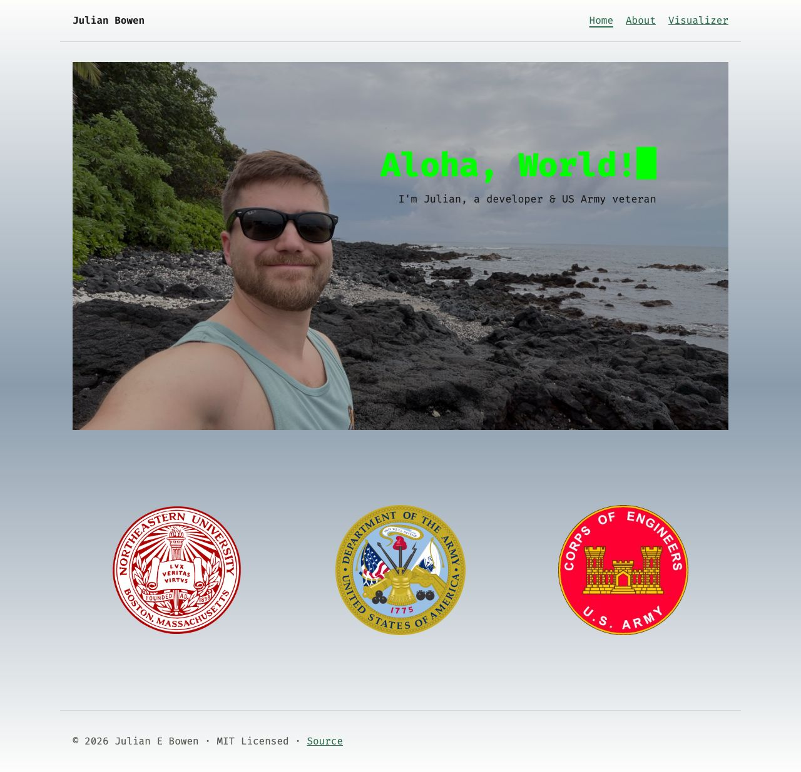
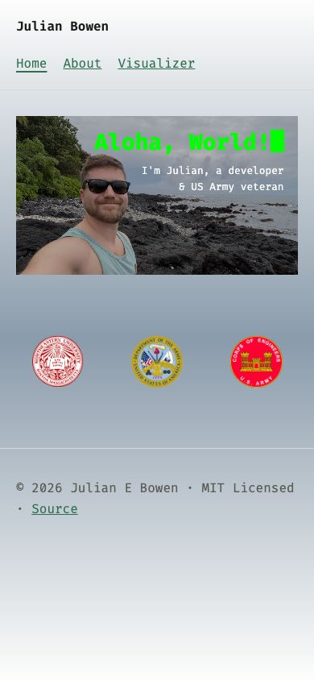
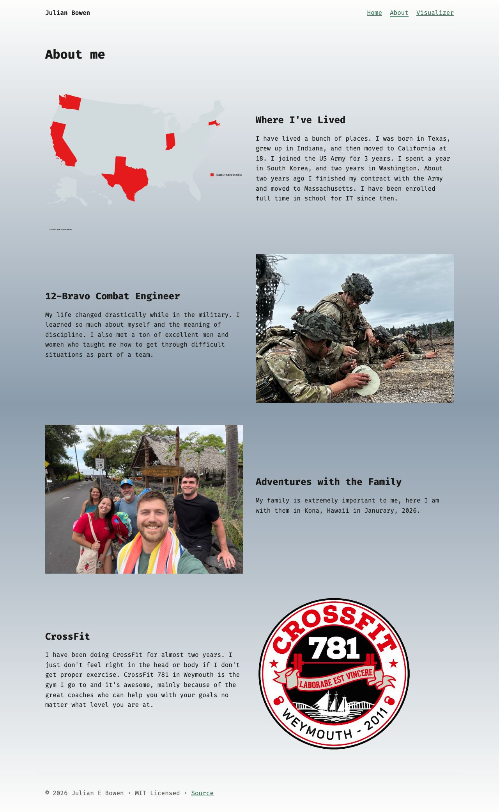
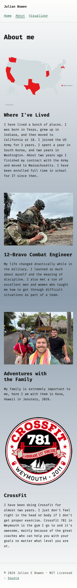
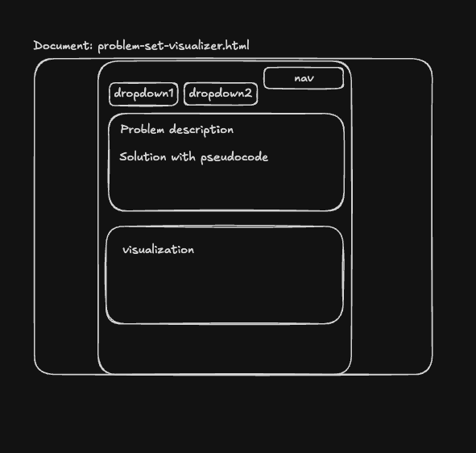
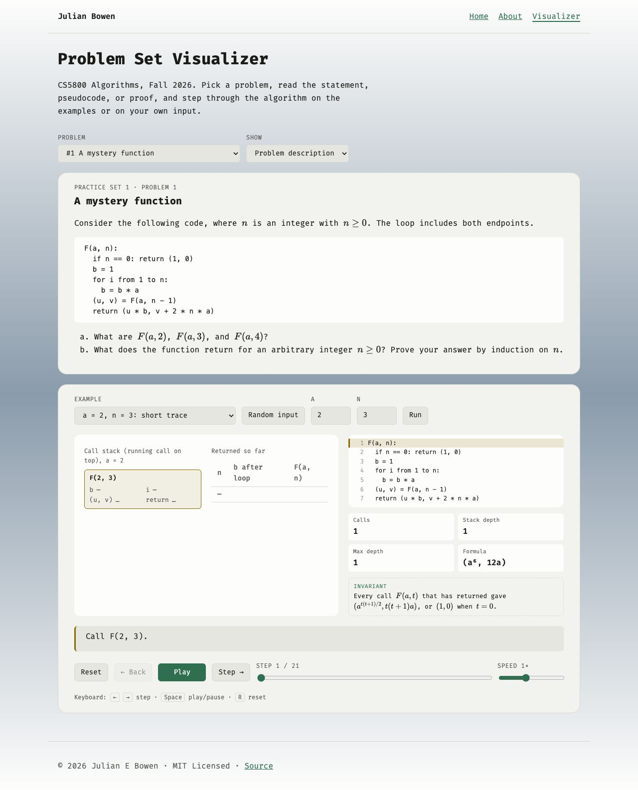
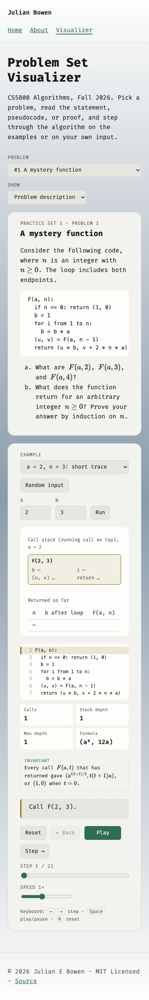

# Design Document — home_page

Author: Julian E Bowen · CS5610 Web Development

## 1. Project Description

home_page is my personal website: a short, friendly introduction to who I am
for classmates, instructors, and future employers. I'm a Northeastern student
and a US Army veteran who served as a 12-Bravo combat engineer, and the site is
meant to get that across in a minute or two of browsing.

The site has three pages:

- **Home** — a beach hero photo with "Aloha, World!" typing itself out in
  terminal green, a one-line tagline, and a row of three crests
  (Northeastern, the US Army, and the Army Corps of Engineers) that sum up
  where I come from.
- **About** — four alternating picture-and-text sections: a map of the states
  I've lived in, my time in the Army, my family, and CrossFit.
- **Problem Set Visualizer** (the AI-generated page) — a study tool for CS5800
  Algorithms. Pick a problem set problem, read the statement, pseudocode, or
  correctness proof, then step through the algorithm line by line on preset
  examples or your own input. New problems are added as the semester goes on.

**In scope:** static content, one original JS component (the typewriter), a
responsive layout that works from phone to desktop, and accessibility basics.
**Deliberately out of scope:** a backend, contact form, blog, or CMS; any CSS
or JS framework; and a build step. None of those are needed for a personal page
of this size, and leaving them out keeps the site fast and easy to maintain.

**Technical approach:** plain HTML, CSS, and vanilla JavaScript ES modules,
served straight from `src/` with no bundler. `js/main.js` is the single entry
point on every page; it finds components by class name and calls each module's
`init` function, and loads the visualizer's modules only on the page that uses
them. Prettier and ESLint keep the code consistent, and GitHub Pages hosts it.

## 2. User Personas

### Persona 1 — Dana Whitfield, technical recruiter

- **Background:** Recruits early-career software engineers for a mid-size
  tech company, and has a soft spot for veteran candidates.
- **Goals:** Quickly figure out who a candidate is, what they've done, and
  whether they can build a clean, working website.
- **Frustrations:** Portfolio sites that are slow, broken on a phone, or all
  flash with no sense of the actual person behind them.
- **Context of use:** Clicks the link from a résumé or LinkedIn, often on her
  phone between meetings. Stays one to three minutes.

### Persona 2 — Professor Ramirez, CS5610 instructor

- **Background:** Teaches web development and grades dozens of student
  homepages against a rubric.
- **Goals:** Confirm the site is valid, accessible, organized, and uses ES
  modules and original JavaScript, then see what makes this one different.
- **Frustrations:** Copy-pasted templates, validator errors, missing alt text,
  and code that is hard to follow.
- **Context of use:** On a laptop with DevTools and the W3C validator open,
  moving between the live site and the GitHub repository. Stays 10–15 minutes.

### Persona 3 — Priya Nair, CS5800 classmate

- **Background:** A fellow Northeastern student taking Algorithms this
  semester.
- **Goals:** Understand how a problem set algorithm actually runs, not just
  read the final answer, especially when studying for an exam.
- **Frustrations:** Static solution PDFs, where it's hard to see how the
  variables change on each step or why a proof works.
- **Context of use:** On a laptop the night before a deadline or exam,
  possibly coming back to the page several times a week. Stays 20+ minutes.

## 3. User Stories

1. > **As** Dana, **I want to** see who Julian is on the first screen **so
   > that** I can decide in seconds whether to keep reading.
   >
   > **Acceptance:** On both phone and desktop, the home page shows a photo, a
   > greeting, and the "developer & US Army veteran" tagline without scrolling.

2. > **As** Dana, **I want to** read a short summary of Julian's background
   > **so that** I understand his path from the Army to software.
   >
   > **Acceptance:** The About page covers where he's lived, his Army service,
   > family, and interests, and is reachable in one click from any page's nav.

3. > **As** Professor Ramirez, **I want to** find the original JavaScript
   > component and its code quickly **so that** I can grade it fairly.
   >
   > **Acceptance:** The typewriter runs on the home page, and the README names
   > the files that implement it (`js/typewriter.js`, wired in `js/main.js`).

4. > **As** Professor Ramirez, **I want** every page to pass the W3C validator
   > and work without a mouse **so that** I know the site is standards
   > compliant and accessible.
   >
   > **Acceptance:** All three pages have zero validator errors, every image
   > has alt text, a "Skip to main content" link appears on the first Tab, and
   > the current page is marked in the nav.

5. > **As** Priya, **I want to** step through an algorithm on my own input
   > **so that** I can check my understanding before the exam.
   >
   > **Acceptance:** On the visualizer, she can pick a problem, enter custom
   > values, and step forward and back (with buttons or arrow keys) while the
   > current pseudocode line and variable values update.

6. > **As** Priya, **I want to** switch between the problem statement,
   > pseudocode, and proof **so that** I can connect the idea to the code
   > without juggling a PDF.
   >
   > **Acceptance:** A dropdown swaps the text pane between the three views
   > without reloading the page.

## 4. Design Mockups

The visualizer was sketched before it was built (below). The other layouts
were worked out directly in the browser, so the images for each page are
screenshots of the finished design at desktop (1280px) and mobile (390px)
widths.

### Home

| Desktop                                      | Mobile                                     |
| -------------------------------------------- | ------------------------------------------ |
|  |  |

### About

| Desktop                                        | Mobile                                       |
| ---------------------------------------------- | -------------------------------------------- |
|  |  |

### AI-generated page

Original sketch: two dropdowns (problem and view) above a text pane, with the
visualization pane below.

| Desktop                                            | Mobile                                           |
| -------------------------------------------------- | ------------------------------------------------ |
|  |  |

## 5. Design Decisions

- **Typeface:** Fira Code, a monospace font, on every page. It gives the site a
  terminal feel that fits a developer's homepage and pairs with the typewriter
  hero. It falls back to the system's monospace font if Google Fonts is
  unavailable.
- **Color palette:** Off-white at the top and bottom of the page fading to a
  soft blue-gray in the middle, with near-black text and a dark green accent
  for links and buttons. The hero heading uses bright terminal green over a
  darkened photo. All colors are CSS custom properties (design tokens) in one
  place, so a change updates the whole site.
- **One theme everywhere:** The visualizer began with a dark theme but was
  switched to the site's light palette so all three pages feel like one site.
  Its highlight colors (blue, orange, amber, green) keep the same meaning in
  every visualization.
- **Layout system:** Flexbox for the header, nav, and the vertical stack of
  sections in `<main>`. CSS Grid for the three crests and the About sections.
  About sections alternate picture-left / picture-right automatically with
  `:nth-of-type(even)`, and collapse to one column (picture on top) below
  48rem. A max-width column (68rem) keeps lines readable on wide screens.
- **Images:** Logos and the states map were cut out as transparent PNGs so
  they sit cleanly on the gradient instead of showing white boxes. The About
  page images have `width` and `height` attributes so the page doesn't jump
  while they load.
- **Accessibility:** A skip link, `aria-current` on the active nav link, alt
  text on every image, and labeled form controls. The typewriter gives screen
  readers the full heading through `aria-label` instead of reading it letter
  by letter. Animations are turned off for users who set
  `prefers-reduced-motion`. Body text and the visualizer's highlight colors
  meet WCAG AA contrast (4.5:1).
- **No framework:** Vanilla HTML, CSS, and ES modules. The site is small, loads
  fast, and every line of it can be read and explained.
